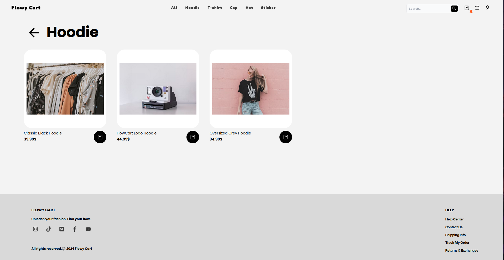
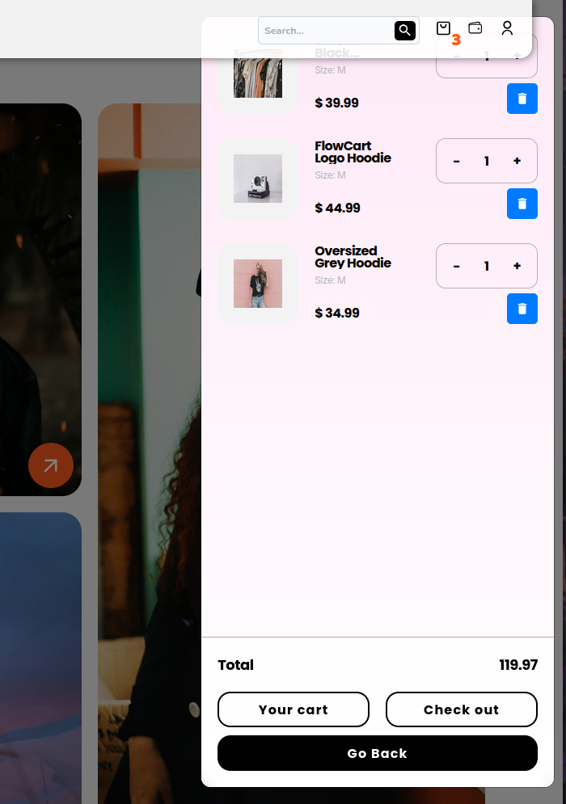
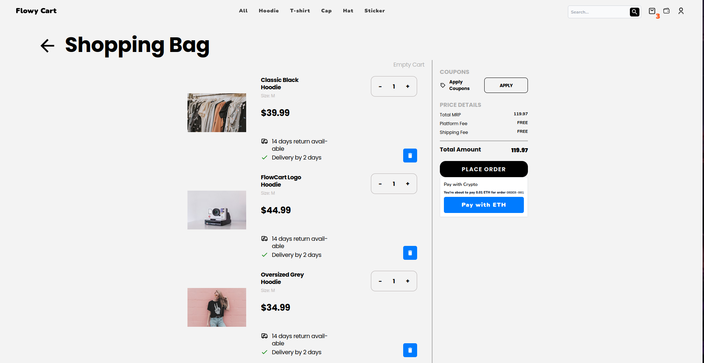
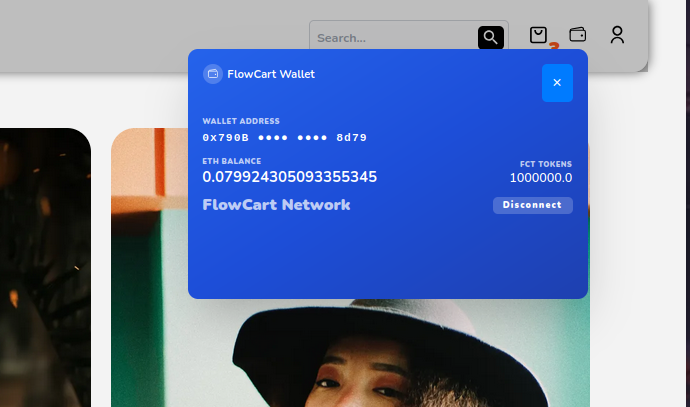

# E-SHOP

A modern e-commerce web application built with React, TypeScript, and Redux.

## 🚀 Features

- Modern React with TypeScript
- State management with Redux Toolkit
- Data fetching with React Query
- Responsive design with React Responsive
- Beautiful animations with Framer Motion and React Spring
- Toast notifications with React Toastify
- Carousel functionality with Swiper
- Styling with Tailwind CSS and SASS

## 📦 Prerequisites

- Node.js (Latest node version recommended)

## 🛠️ Installation

1. Clone the repository:
```bash
git clone https://github.com/0xsoftdev/e-shop-frontend
cd e-shop-frontend/frontend
```

2. Install dependencies:
```bash
npm install
# or
yarn install
```

## 🏃‍♂️ Running the Project

### Development
```bash
npm run dev
# or
yarn dev
```
You can view the shop dashboard on localhost:5173.

## 🛠️ Tech Stack

- **Frontend Framework:** React 18
- **Language:** TypeScript
- **State Management:** Redux Toolkit
- **Data Fetching:** React Query
- **Routing:** React Router v6
- **Styling:** 
  - Tailwind CSS
  - SASS
- **UI Components & Animations:**
  - Framer Motion
  - React Spring
  - React Icons
  - Swiper
- **Development Tools:**
  - Vite
  - ESLint
  - TypeScript
  - PostCSS
  - Autoprefixer


## 📸 Screenshots

Here are some screenshots of the project:


<div align="center">
  <table>
    <tr>
      <td></td>
      <td></td>
    </tr>
    <tr>
      <td>
        
        
      </td>
      <td></td>
    </tr>
  </table>
</div>

## 📝 Project Structure

```
flowycart/
├── src/
│   ├── components/     # Reusable components
│   ├── pages/         # Page components
│   ├── store/         # Redux store configuration
│   ├── hooks/         # Custom React hooks
│   ├── services/      # API services
│   ├── types/         # TypeScript type definitions
│   ├── utils/         # Utility functions
│   └── styles/        # Global styles and SASS files
├── public/            # Static assets
└── package.json       # Project dependencies and scripts
```